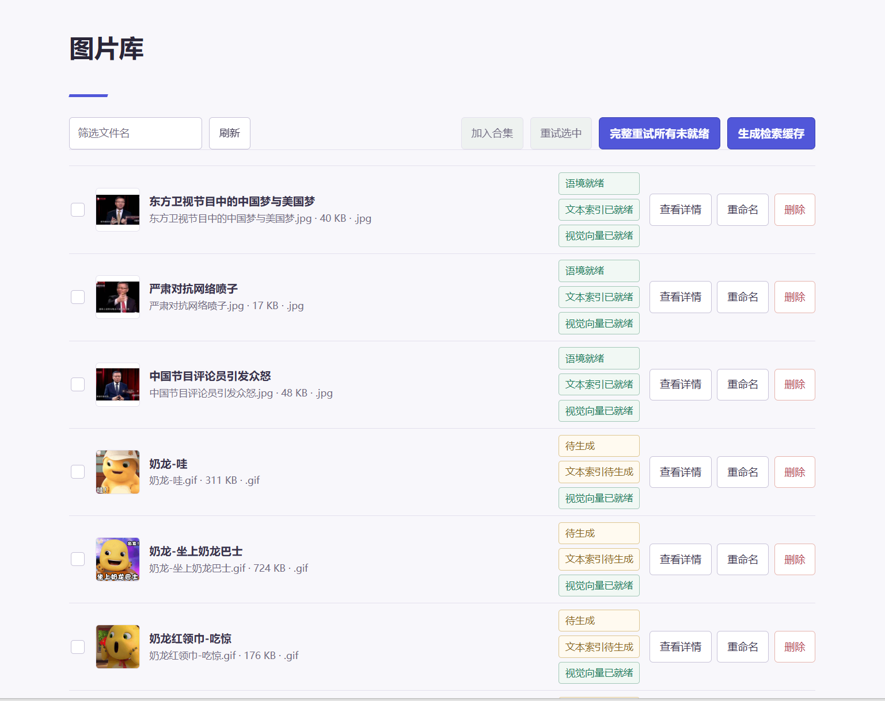
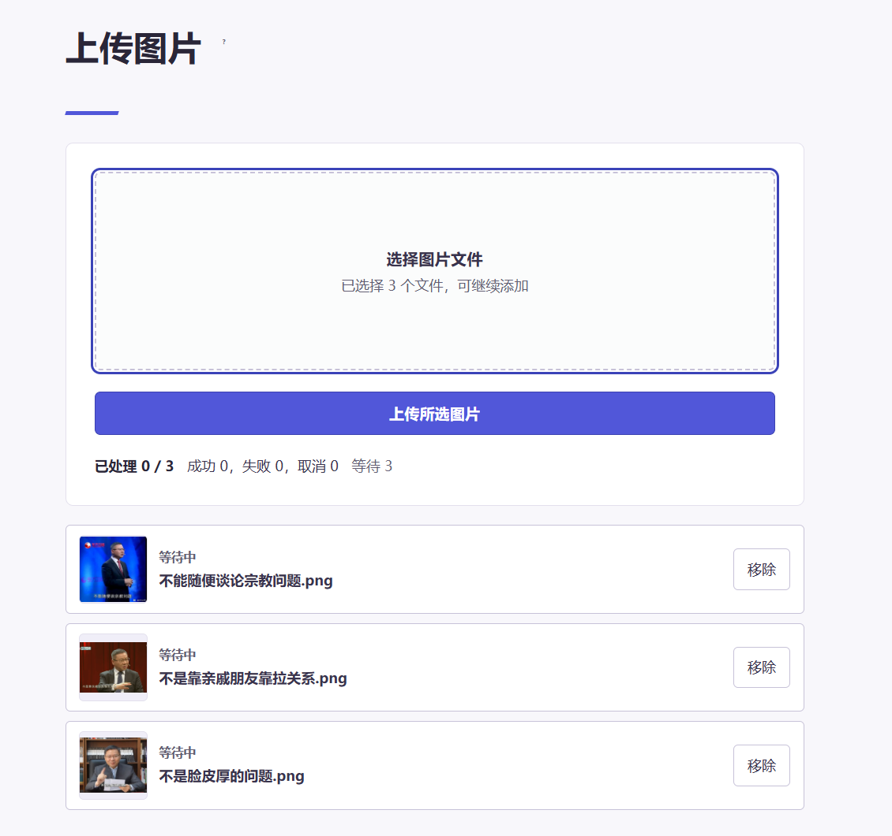
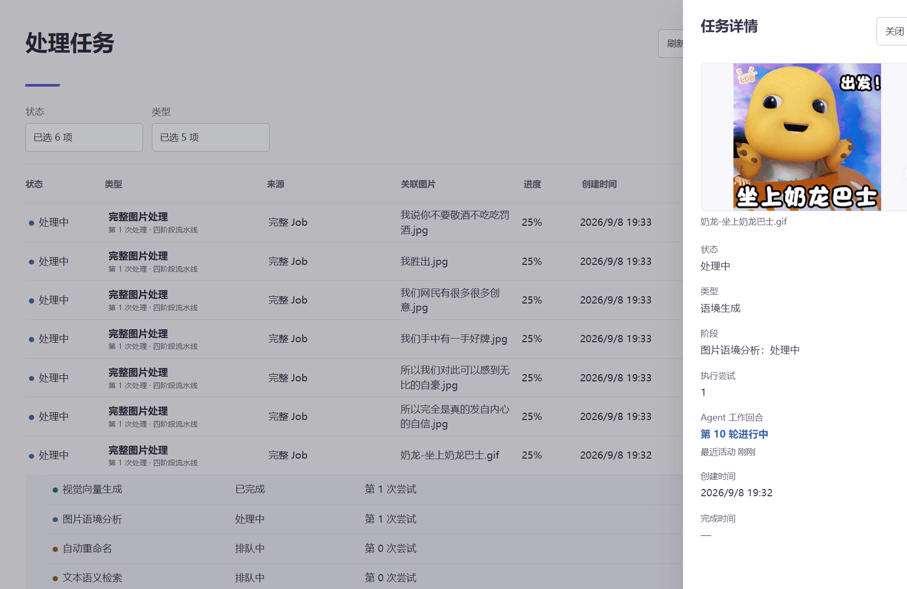

<div align="center">

MemeMeow 是一个基于自然语言的表情包检索工具。它能让你通过描述想要的场景或心情，快速找到合适的表情包（无需记住具体的文件名或标签）。

> [!CAUTION]
> 本项目返回的表情包结果均由 AI 理解和生成，与开发者本人观点无关。

<a id="-features"></a>

## ✨ 核心特性

- **🤖 自然语言检索**: 采用 Embedding 模型，实现 Q&A 式的检索，能够根据你的描述（如“表达无奈”）找到匹配的图片。
- **🧠 自动化语境理解**: 内置 OpenCode Agent，当你上传图片时，Agent 会对图片进行结构化分析、生成语境和描述。
- **👁️ 视觉近邻搜索**: 支持本地 DINOv2 视觉模型，实现图片之间的相似度搜索。
- **📦 容器部署**: 提供 Vue 3 Web 界面和统一的 API，服务可通过 Docker Compose 启动。
- **⚡ 任务调度**: 内置受控并发队列，支持长任务异步处理（如批量图片导入、后台模型推理），支持单机部署。


<a id="-usage"></a>

## 📖 核心功能与使用说明

### 1. 自然语言检索 (Search)

系统的主要检索页面，支持通过自然语言查找目标图片。

* **语义检索**：支持输入日常场景描述（如：“表达无奈”、“早上打工人”），系统通过 Embedding 机制检索匹配的图片，不需要依赖确切的文件名或固定的标签。
* **图片操作**：将鼠标悬浮在图片上，可点击“复制图片”或“复制链接”按钮，用于在其他应用中粘贴使用。
* **详情与预览**：点击图片卡片，可查看后台 Agent 提取的图片描述和语境信息；点击卡片上的放大镜图标可全屏预览原图。

### 2. 图片库 (Library)

用于浏览、筛选和管理已上传的表情包文件。



* **浏览与过滤**：支持分页查看系统内的所有图片资源，并提供文本过滤功能以定位特定图片。
* **处理状态显示**：图片卡片上会显示各项后台任务（如：视觉向量化、元数据提取、文本特征提取）的状态图标，用于区分该阶段的处理是成功还是失败。
* **批量操作与合集 (Collections)**：支持多选图片，将其打包加入“合集包”，用于后续的统一管理或导出。
* **任务重试**：当部分图片在后台处理环节（如调用大模型分析）失败时，可选中这些图片并点击“重试”按钮，将其重新加入任务队列。

### 3. 上传图片 (Upload)

将本地的新表情包文件上传至系统并触发后台分析。



* **上传方式**：支持以下三种文件导入方式：
  * **拖拽上传**：将单张图片或多张图片拖入虚线区域。
  * **剪贴板上传**：在页面中使用快捷键（如 `Ctrl+V` 或 `Cmd+V`）直接粘贴剪贴板中的图片。
  * **点击上传**：点击区域打开文件选择器选择本地文件。
* **处理选项设置**：在确认提交前，可配置后台 Agent 对这批图片的分析规则：
  * **反向搜索策略**：设置在遇到较难理解的图片时，是否允许 Agent 使用谷歌（Google）进行联网的“以图搜图”，从而获取图片的来源和背景信息。
  * **自动命名**：选择是否允许 AI 根据图片内容生成新的文件名。
* **上传队列**：页面下方会显示当前批次文件的上传进度，并支持对上传失败的单个文件进行重试。

### 4. 处理任务 (Tasks)

查看和管理后台异步执行的长时任务记录。



* **任务状态**：上传图片后的语境理解、合集的导入等操作会在后台生成任务记录。页面会定期刷新并显示当前任务处于排队中、运行中、成功或失败状态。
* **分类与筛选**：支持按照“任务类型”和“执行状态”对任务列表进行过滤。
* **任务详情**：点击具体的任务列表项，会从侧边展开“任务抽屉 (Task Drawer)”，展示任务执行的详细步骤和报错日志（如：网络连接超时、API 调用错误等）。
* **中断重试**：针对执行失败的任务，可在任务详情页点击重试按钮，系统会尝试从发生错误的环节继续执行。

<a id="-api"></a>

<a id="-quick-start"></a>

## 🚀 快速开始

本项目依赖容器化环境进行隔离与部署，请确保机器已安装 **Docker Engine** 与 **Compose v2 插件**。

### 1. 克隆代码与配置环境变量

```bash
git clone https://github.com/MemeMeow-Studio/MemeMeow.git
cd MemeMeow

# 如果你没有安装 uv，也可以直接复制 .env.example 并手动编辑:
# cp .env.example .env
uv run python -m scripts.sync_env
```

执行完毕后，请编辑项目目录下的 `.env` 文件，填写必要的模型配置（特别是 `MEMEMEOW_OPENCODE_BASE_URL` 与 `MEMEMEOW_OPENCODE_API_KEY`，用于 Agent 处理图片语境）。

### 2. 一键启动

```bash
./start.sh start
```

该命令会启动 PostgreSQL（附带 pgvector）、代理执行器 (Agent Executor)、视觉服务以及后端 API 容器。
服务启动成功后，浏览器访问 `http://127.0.0.1:8275/` 即可看到前端界面。

### 3. 可选：下载本地视觉权重

本地视觉向量生成是图片处理流程的必需能力，需要下载官方 DINOv2 权重：

```bash
mkdir -p data/models
curl -L --fail --output data/models/dinov2_vitb14_pretrain.pth \
  https://dl.fbaipublicfiles.com/dinov2/dinov2_vitb14/dinov2_vitb14_pretrain.pth
```

下载完成后，若环境配置无误，容器内部会自动挂载并启动服务。

### 常用运维命令

```bash
./start.sh status         # 查看运行状态
./start.sh logs           # 查看所有服务的日志
./start.sh logs mememeow -f  # 持续跟踪主后端的日志
./start.sh stop           # 安全停止服务（不会丢失数据）
```

## 🔌 进阶设计与 API

MemeMeow 本质是一个 API 驱动的服务。如果你是开发者，可以直接调用 `POST /search` 进行跨应用整合，只要不涉及后台管理，相关检索 API 可供调用。

* **Endpoint**: `POST http://localhost:8275/search`
* **JSON 请求示例**: `{"query": "无奈叹气", "n_results": 5, "llm_enhance": false}`
* **JSON 响应示例**: `{"results":["/media/uuid-1", "/media/uuid-2"]}`

<!-- **🛠️ 面向开发者的架构文档**

如果你想了解 MemeMeow 更底层的设计机制（如安全边界、权限管理、前后端联调方案），我们将其抽离到了独立的文档中：
👉 **[高级部署与架构指南 (docs/deployment.md)](docs/deployment.md)**

关于双环境隔离设计与作用域约束，请查阅 [应用作用域设计 (docs/application-scope.md)](docs/application-scope.md)。 -->

<a id="-related-applications"></a>

## 📦 社区相关应用

基于 MemeMeow 衍生出的社区项目：

| 应用                | 作者                                             | GitHub                                                                                           | 链接                                                                                                             |
| ------------------- | ------------------------------------------------ | ------------------------------------------------------------------------------------------------ | ---------------------------------------------------------------------------------------------------------------- |
| VVQuest网页端       |                                                  | [VVQuest](https://github.com/DanielZhangyc/VVQuest)                                               | [链接](https://zvv.quest)                                                                                         |
| VVQuest*iOS*捷径  | [TomSmith163](https://github.com/TomSmith163)     |                                                                                                  | [链接](https://www.icloud.com/shortcuts/a7084c7ae29e4de5898ce7c8386705f3)                                         |
| HakuBot().vv() 命令 | [apple_catwaii](https://github.com/Apple-QAQ)     |                                                                                                  | [QQ](https://qm.qq.com/cgi-bin/qm/qr?k=GJSCe1_B98V4Ni6leVtKAjQrAtJW-VG5)                                          |
| VVQuest油猴脚本     | [DanielZhangyc](https://github.com/DanielZhangyc) | [vvquest-tampermonkey-extension](https://github.com/DanielZhangyc/vvquest-tampermonkey-extension) | [greasyfork](https://greasyfork.org/zh-CN/scripts/528477-vvquest-vv%E8%A1%A8%E6%83%85%E5%8C%85%E5%8A%A9%E6%89%8B) |
| Yunzai-Bot 插件     | [TomyJan](https://github.com/TomyJan)             | [TomyJan/Yunzai-TomyJan-Plugin](https://github.com/TomyJan/Yunzai-TomyJan-Plugin/)                |                                                                                                                  |

> [!TIP]
> 如果你想将自己开发的衍生应用加到这个列表，欢迎提交 [PR](https://github.com/MemeMeow-Studio/MemeMeow/pulls) 或 [Issue](https://github.com/MemeMeow-Studio/MemeMeow/issues)！

## 📄 License & ⭐ Star History

本项目采用 [MIT](LICENSE) 开源协议。

[](https://star-history.com/#MemeMeow-Studio/MemeMeow&Date)

*(注：迁移前的 Streamlit 旧版本已归档至 `legacy/streamlit-v1/`，不再参与当前版本的构建与测试)*
